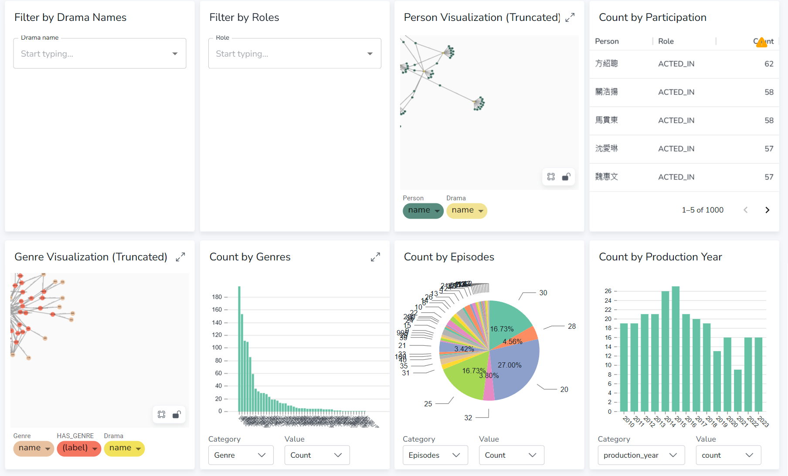
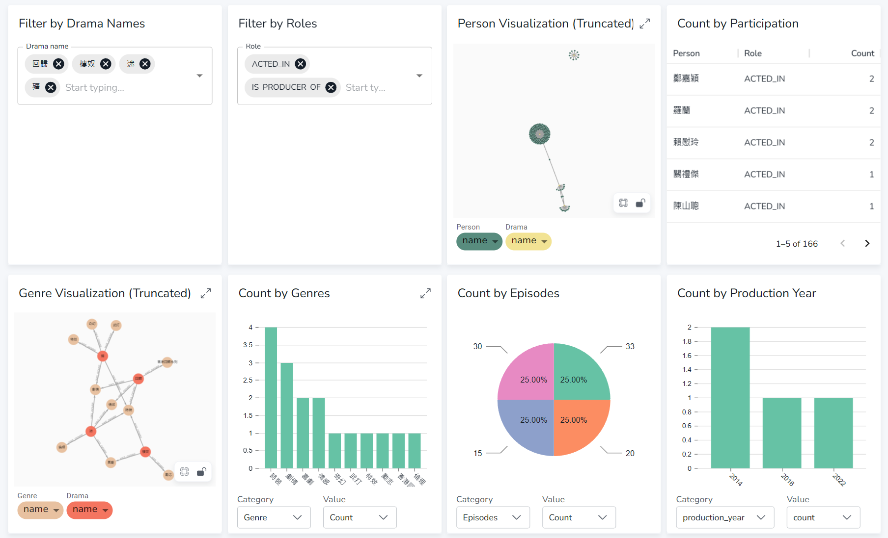
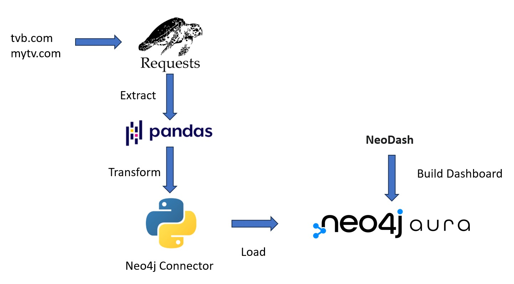

### Overview
This project extract the details of TVB Drama (2010 to 2023) from tvb.com and mytv.com. The information included:
  * Drama name
  * Genre
  * Production year
  * Number of episodes
  * Actor/Role/Crew List

The extracted and transformed data is loaded to a neo4j AuraDB instance, then creating a dashboard using NeoDash

Filtered Results:

### Framework

### Prerequisites
1.	Python
2.	Jupyter Notebook
3.	Neo4j AuraDB instance
4.	Optional: Docker

### Instructions
1.	Run the ExtractTransform\main.ipynb to extract and transform data from TVB & MyTV.

2.	Configure the Load\main.py, load the data to a Neo4j instance.
    * URI: Connection URI for the neo4j instance
    * AUTH: Login credentials for the neo4j instance (username,password)
    * db: Name of database to load the data
    * path to the extracted & transformed json files

3.	Run NeoDash on https://neodash.graphapp.io/, configure connection to your Neo4j AuraDB instance with Dashboard\dashboard.json as the dashboard template.
    * (Optional) Run NeoDash on prebuilt docker image, the configuration can be referred to https://neo4j.com/labs/neodash/2.1/developer-guide/standalone-mode/